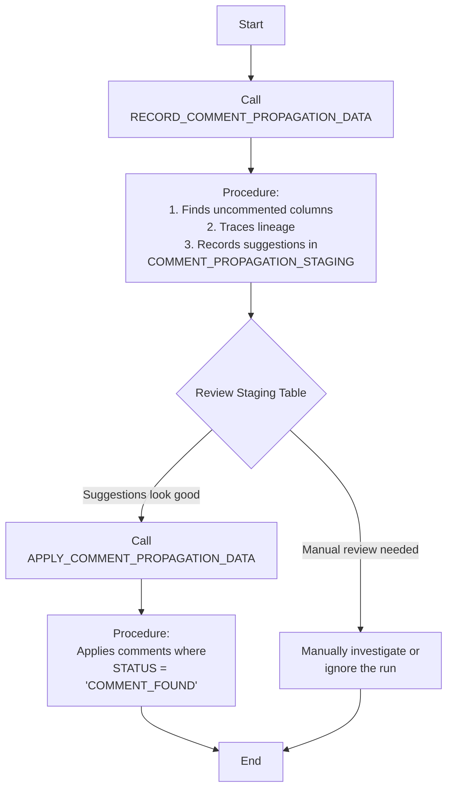

# Snowflake Propagate Column Comments

[](https://www.snowflake.com/)

## Version 0.5

This project provides a Snowflake stored procedure to automate the propagation of column comments from ancestor tables (i.e., upstream sources) to descendant tables (i.e., downstream targets) using data lineage.

## Objective

The primary goal is to identify columns in a given table that lack comments and automatically find a corresponding comment from an ancestor table in its lineage. This is useful for maintaining data documentation and ensuring that comments are consistently applied as data flows through your data warehouse.

The solution is delivered as a single deployment script that creates two stored procedures:

1. **`RECORD_COMMENT_PROPAGATION_DATA`**: The main procedure that you call to find and record comment suggestions in a staging table.
2. **`APPLY_COMMENT_PROPAGATION_DATA`**: A second procedure that you call to apply the suggestions from the staging table.

This two-step process allows you to review the suggested comments before applying them.

## How It Works



The solution uses a single deployment script (`deploy.sql`) to create all the necessary database objects. The core logic is contained within the `RECORD_COMMENT_PROPAGATION_DATA` procedure, which operates as follows:

1. **Finds Uncommented Columns**: It first identifies all columns in the target table that have `NULL` or empty comments.
2. **Discovers Lineage**: Using Snowflake's `GET_LINEAGE` function, it constructs the complete upstream lineage for all uncommented columns. This is done efficiently using a single, dynamic `UNION ALL` query.
3. **Gathers All Potential Comments**: It then queries the `INFORMATION_SCHEMA` of all unique upstream databases to collect all available comments for the identified ancestor columns.
4. **Determines Final Status**: In a single, multi-CTE query, it determines the final status for each column based on a clear order of precedence:
    * **Structural Ambiguity**: It first checks if a column has a "structural fork" in its lineage (i.e., more than one parent at the same, closest distance). If so, it is marked `MULTIPLE_COLUMNS_FOUND_AT_SAME_DISTANCE`.
    * **Comment Found**: If the lineage is structurally sound (a single parent at the closest distance), it checks if that parent has a comment. If it does, the status is `COMMENT_FOUND`.
    * **No Comment Found**: If the single parent has no comment, or if there is no lineage, the status is `NO_COMMENT_FOUND`.
5. **Logs Results**: The final, processed results are inserted into the `COMMENT_PROPAGATION_STAGING` table with a unique `RUN_ID`.

## Permissions

This procedure relies on `SNOWFLAKE.CORE.GET_LINEAGE` and the `INFORMATION_SCHEMA` for each upstream database. To ensure proper execution, the procedure should be created and run by a role with `USAGE` on all upstream databases.

For more information, see the [Snowflake documentation on `GET_LINEAGE`](https://docs.snowflake.com/en/sql-reference/functions/get_lineage-snowflake-core). Note that this feature requires Snowflake Enterprise Edition (or higher).

## Setup

The deployment script is parameterized to allow you to control where the solution's objects are created.

1. **Configure Deployment**: Open the `deploy.sql` script and set the `DEPLOY_DATABASE` and `DEPLOY_SCHEMA` variables at the top of the file to your desired target locations.

    ```sql
    SET DEPLOY_DATABASE = 'COMMON';
    SET DEPLOY_SCHEMA = 'COMMENT_PROPAGATION';
    ```

2. **Run the Script**: Execute the entire `deploy.sql` script in your Snowflake environment. It will create the database if it does not exist and then create all the necessary objects within the specified schema.

## Usage

The comment propagation process is a two-step process:

### 1. Record Comment Suggestions

To run the comment propagation process, call the `RECORD_COMMENT_PROPAGATION_DATA` stored procedure with the database, schema, and table name of the table you want to process.

```sql
CALL RECORD_COMMENT_PROPAGATION_DATA('MY_DATABASE', 'MY_SCHEMA', 'MY_TABLE');
```

The procedure will return a `RUN_ID`, which you will need for the next steps.

### 2. Review the Results

After the procedure completes, you can query the `COMMENT_PROPAGATION_STAGING` table to see the results. Use the `RUN_ID` returned by the stored procedure to filter the results for a specific run.

The `STATUS` column will indicate the outcome for each column:

* `COMMENT_FOUND`: A single, unambiguous comment was found at the closest lineage distance.
* `MULTIPLE_COLUMNS_FOUND_AT_SAME_DISTANCE`: The column has a structural fork in its lineage (multiple parents at the same closest distance), making the source ambiguous.
* `NO_COMMENT_FOUND`: No comment was found for the column, either because its single parent had no comment or because it had no lineage.

```sql
-- Set these variables to match the ones in your deploy.sql script
SET DEPLOY_DATABASE = 'COMMON';
SET DEPLOY_SCHEMA = 'COMMENT_PROPAGATION';
SET RUN_ID_TO_REVIEW = 'your_run_id'; -- Replace with the actual RUN_ID

-- Query the staging table using the fully qualified name
SELECT *
FROM IDENTIFIER($DEPLOY_DATABASE || '.' || $DEPLOY_SCHEMA || '.COMMENT_PROPAGATION_STAGING')
WHERE RUN_ID = $RUN_ID_TO_REVIEW;
```

### 3. Apply the Comments

After you have reviewed the suggestions, call the `APPLY_COMMENT_PROPAGATION_DATA` stored procedure with the `RUN_ID`. This will apply the comments for all columns where the `STATUS` is `COMMENT_FOUND`.

```sql
-- Replace 'your_run_id' with the actual RUN_ID
CALL APPLY_COMMENT_PROPAGATION_DATA('your_run_id');
```

## Testing

The project includes a robust and simplified test suite (`testing/test.sql`) that validates the three core logical outcomes:

* **`COMMENT_FOUND`**: Tests that a comment is correctly propagated from a single, unambiguous parent.
* **`MULTIPLE_COLUMNS_FOUND_AT_SAME_DISTANCE`**: Tests that a column derived from two parents is correctly flagged as ambiguous.
* **`NO_COMMENT_FOUND`**: Tests that a column whose parent has no comment is correctly flagged.

To run the tests, execute `testing/test.sql` after deploying the solution.

## Alternative Solutions

### Snowflake Cortex AI

It is worth noting that Snowflake offers a native feature that uses generative AI to suggest comments for tables and columns. This feature, powered by Snowflake Cortex, can generate descriptions based on object metadata and sample data.

This project differs in that it uses a deterministic, lineage-based approach rather than a generative one. It is designed for scenarios where you want to enforce consistency by propagating existing, human-curated comments down through a data pipeline.

For more information on the native AI feature, see the [Snowflake documentation on generating descriptions with Cortex](https://docs.snowflake.com/en/user-guide/ui-snowsight-cortex-descriptions).

## Limitations and Considerations

This solution relies entirely on the `SNOWFLAKE.CORE.GET_LINEAGE` function. As such, it is subject to the same limitations as the underlying function. The most important considerations are:

* **Maximum Lineage Distance**: `GET_LINEAGE` can trace a maximum of 5 levels upstream. This means the procedure cannot find comments from ancestors that are more than 5 hops away.
  * **Workaround**: For very long lineage chains, you can run the comment propagation procedure on intermediate tables first. This will "carry" the comments forward, allowing them to be discovered by downstream tables.
* **Unsupported Objects**: Lineage is not available for objects in shared databases, the shared `SNOWFLAKE` database, or in any `INFORMATION_SCHEMA`.
* **Disjointed Queries**: The function cannot track data lineage that is broken up into separate, disjointed queries (e.g., selecting a value into a session variable and then inserting that variable into a table). Lineage is only captured for single, continuous data flow statements (e.g., `CREATE TABLE AS SELECT...`, `INSERT INTO ... SELECT ...`).

For more details, please refer to the official Snowflake documentation on [GET_LINEAGE](https://docs.snowflake.com/en/sql-reference/functions/get_lineage-snowflake-core) and [Lineage Limitations](https://docs.snowflake.com/en/user-guide/ui-snowsight-lineage#limitations-and-considerations).

## Disclaimer

* **No Warranty**: This project is provided "as-is" and without any warranty, express or implied.
* **No Official Support**: This is a community-driven project and is **not** officially supported by Snowflake.
* **Use at Your Own Risk**: You assume all risks associated with this solution. The author and contributors are not responsible for any issues or unexpected outcomes that may arise from its use.
* **Test Thoroughly**: It is strongly recommended to test this solution in a non-production environment before deploying it to any critical systems.
