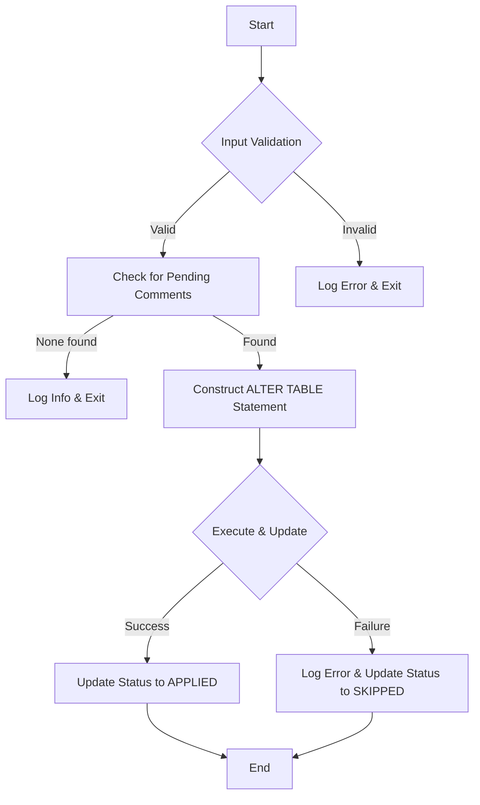

# `APPLY_COMMENT_PROPAGATION_DATA`

This document provides a detailed, step-by-step breakdown of the `APPLY_COMMENT_PROPAGATION_DATA` stored procedure.

## Objective

The purpose of this procedure is to apply the column comments that were previously identified by the `RECORD_COMMENT_PROPAGATION_DATA` procedure and recorded in the `COMMENT_PROPAGATION_STAGING` table. It only applies comments for columns with the status `COMMENT_FOUND`.

## Parameters

| Name | Type | Description |
| --- | --- | --- |
| `P_RUN_ID` | `VARCHAR` | The unique identifier for the run whose comments you want to apply. |

## High-Level Flow

This procedure is designed to be a safe and atomic operation. It applies all pending comments for a given run in a single `ALTER TABLE` statement.



## Detailed Logic

### 1. Initial Setup and Validation

- **Input Validation**: The procedure first checks that the input `P_RUN_ID` is not `NULL`. If it is, it logs a fatal error and exits.
- **Span Attributes**: For observability, it sets a span attribute for the `RUN_ID`, making traces easier to identify.
- **Run ID Existence Check**: It verifies that the provided `RUN_ID` exists in the `COMMENT_PROPAGATION_STAGING` table. If not, it logs a fatal error and exits.

### 2. Core Processing

#### Step 1: Check for Comments to Apply

The procedure queries the staging table to see if there are any records for the given `RUN_ID` with a status of `COMMENT_FOUND` that have not yet been applied (`APPLICATION_STATUS IS NULL`).

- If no such records are found, it logs an informational message and exits gracefully.

#### Step 2: Construct the `ALTER TABLE` Statement

If there are comments to apply, the procedure dynamically constructs a single `ALTER TABLE ... MODIFY ...` statement. It uses `LISTAGG` to concatenate all the `COLUMN "col_name" COMMENT '...'` clauses into one statement.

- This is a critical design choice, as it ensures all comments for a table are applied in a single, atomic transaction.

```sql
SELECT LISTAGG(CONCAT('COLUMN ', SAFE_QUOTE(SOURCE_COLUMN_NAME), ' COMMENT ''', REPLACE(TARGET_COMMENT, '''', ''''''), ''''), ', ')
INTO alter_sql
FROM COMMENT_PROPAGATION_STAGING
WHERE RUN_ID = :P_RUN_ID AND STATUS = 'COMMENT_FOUND' AND APPLICATION_STATUS IS NULL;
```

#### Step 3: Execute the Statement and Update Status

This part of the procedure is wrapped in its own `BEGIN...END` block with an exception handler to gracefully manage failures.

- **Execution**: It runs the dynamically constructed `ALTER TABLE` statement using `EXECUTE IMMEDIATE`.
- **On Success**:
  - It updates the `APPLICATION_STATUS` to `'APPLIED'` for all processed records in the staging table.
  - It increments a counter for the total number of comments successfully applied.
- **On Failure**:
  - The `EXCEPTION` block catches the error.
  - It logs a detailed error message, including the columns that failed.
  - It updates the `APPLICATION_STATUS` to `'SKIPPED'` for the records.
  - It increments a counter for the total number of comments skipped.

### 3. Finalization

The procedure logs a final success message with the `RUN_ID` and the total number of comments applied and skipped. This message is also returned as the output of the procedure call.
