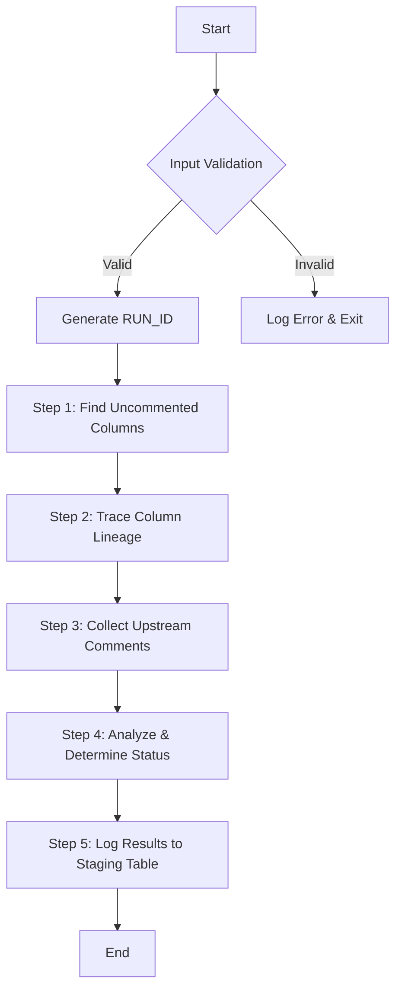

# `RECORD_COMMENT_PROPAGATION_DATA`

This document provides a detailed, step-by-step breakdown of the `RECORD_COMMENT_PROPAGATION_DATA` stored procedure.

## Objective

The primary purpose of this procedure is to identify columns in a specified source table that are missing comments and to find potential comments for them by tracing their data lineage. The results are stored in the `COMMENT_PROPAGATION_STAGING` table for review.

## Parameters

| Name | Type | Description |
| --- | --- | --- |
| `P_DATABASE_NAME` | `VARCHAR` | The name of the database containing the source table. |
| `P_SCHEMA_NAME` | `VARCHAR` | The name of the schema containing the source table. |
| `P_TABLE_NAME` | `VARCHAR` | The name of the source table to process. |

## High-Level Flow

The procedure follows a clear, multi-step process to ensure that comment suggestions are accurate and unambiguous.



## Detailed Logic

### 1. Initial Setup and Validation

- **Input Validation**: The procedure first checks that none of the input parameters (`P_DATABASE_NAME`, `P_SCHEMA_NAME`, `P_TABLE_NAME`) are `NULL`. If any are, it logs a fatal error and exits.
- **Span Attributes**: For observability, it sets span attributes for the target table, making traces easier to identify.
- **FQN Construction**: It constructs the fully qualified names (FQNs) for the source table and its corresponding `INFORMATION_SCHEMA` views.
- **Table Existence Check**: It verifies that the source table exists in the specified schema. If not, it logs a fatal error and exits.

### 2. Core Processing

This part of the procedure is wrapped in a `BEGIN...END` block with a `RAISE` exception handler to ensure that any unexpected failures are surfaced.

#### Step 1: Find Uncommented Columns

The procedure identifies all columns in the source table that have a `NULL` or empty comment and stores them in a temporary table named `temp_uncommented_columns`.

- **Source**: `INFORMATION_SCHEMA.COLUMNS`
- **Output**: `temp_uncommented_columns`

```sql
CREATE OR REPLACE TEMPORARY TABLE temp_uncommented_columns AS
SELECT
    TABLE_CATALOG AS source_database_name,
    TABLE_SCHEMA AS source_schema_name,
    TABLE_NAME AS source_table_name,
    COLUMN_NAME AS source_column_name,
    SAFE_QUOTE(TABLE_CATALOG) || '.' || SAFE_QUOTE(TABLE_SCHEMA) || '.' || SAFE_QUOTE(TABLE_NAME) || '.' || SAFE_QUOTE(COLUMN_NAME) as source_column_fqn
FROM IDENTIFIER(:columns_view_fqn)
WHERE TABLE_SCHEMA = :P_SCHEMA_NAME
  AND TABLE_NAME = :P_TABLE_NAME
  AND (COMMENT IS NULL OR COMMENT = '');
```

#### Step 2: Trace Column Lineage

For each uncommented column, it uses the `SNOWFLAKE.CORE.GET_LINEAGE` function to trace its upstream lineage. To do this efficiently, it dynamically constructs a single `UNION ALL` query that fetches the lineage for all columns at once.

- **Source**: `temp_uncommented_columns`, `SNOWFLAKE.CORE.GET_LINEAGE`
- **Output**: `temp_lineage`

#### Step 3: Collect Upstream Comments

The procedure identifies all unique databases from the lineage results and dynamically queries their `INFORMATION_SCHEMA.COLUMNS` views to gather all available comments for the ancestor columns.

- **Source**: `temp_lineage`, `INFORMATION_SCHEMA.COLUMNS` (for each upstream database)
- **Output**: `temp_all_upstream_column_comments`

#### Step 4 & 5: Analyze, Determine Status, and Log Results

This is the final and most critical step, where the procedure analyzes the collected data and inserts the results into the `COMMENT_PROPAGATION_STAGING` table. This is performed in a single `INSERT ... SELECT` statement with a multi-CTE query structure for clarity and performance.

- **`min_lineage_distance`**: Finds the closest distance for each source column with lineage.
- **`closest_parent_counts`**: Counts how many parents exist at that closest distance.
- **`single_parent_details`**: Gathers the details for columns that have only one parent at the closest distance.
- **Final `SELECT`**: Joins all the CTEs and determines the final `STATUS` based on the following logic:
    - If `parent_count > 1`, the status is `MULTIPLE_COLUMNS_FOUND_AT_SAME_DISTANCE`.
    - If a `target_comment` is found for a single parent, the status is `COMMENT_FOUND`.
    - Otherwise, the status is `NO_COMMENT_FOUND`.

The results, including the generated `RUN_ID`, are then inserted into the `COMMENT_PROPAGATION_STAGING` table.

### 3. Finalization

The procedure logs a final success message with the `RUN_ID` and the total number of uncommented columns processed. This message is also returned as the output of the procedure call.
